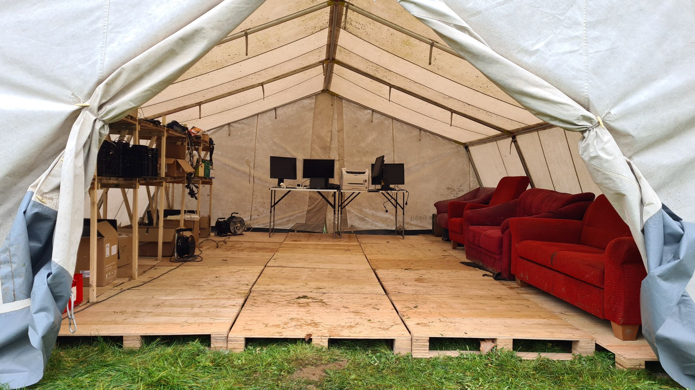

::: success
Da wir alles so gut wie möglich versuchen in [Eurokisten](https://www.kanister-vertrieb.de/eurobehaelter/) zu transportieren und zu lagern, haben wir uns ein Regalsystem überlegt, das genau auf SG-Zelte und Eurokisten zugeschnitten ist und sehr leicht auf- und abzubauen ist.

**Es besteht aus 2 Teilen:**  
\- klappbare Seitenteile, die mit den Verstrebungen in Reihe geschalten werden können  
\- steckbare Regalböden, die einfach auf die Seitenteile draufgelegt werden

:::

**Maße (aufgebaut):**  
Die Regale sind 1,50m hoch, passen also in jedes beliebige SG-Zelt.  
Die Regalbretter werden auf 90cm und 1,30m Höhe angebracht - jeweils 80cm (B) x 60cm (L).  
In jedes Regal passen somit genau 4 Eurokisten - plus den Raum unter dem Regal.  
Das oberste Fach ist nach oben hin offen, also nur durch das Zeltdach limitiert.

**Transport:**  
1 Seitenteil wiegt 4kg, ein Regalbrett wiegt 6,4kg.  
Die Regalbretter werden auf Palette gestapelt - 2 Stück nebeneinander - pro Schicht 5cm hoch.  
Die Seitenteile brauchen ca. 12x16cm Platz. Auf einen Palettenstellplatz passen rund 50 Seitenteile.

**Mengenberechnung:**  
Wir haben aktuell 115 Regalbretter und 60 Seitenteile. Pro Regal brauchst du zwei Regalbretter.  
Wenn du die Regale in Reihe schaltest , brauchst du pro Reihe genau 1 Seitenteil mehr wie Regale.

**SG-Zelt-Beispiele mit optimaler Platznutzung:**  
\- SG12: 2x3 Regale seitlich, 1x4 hinten quer = 13 Seitenteile + 20 Regalbretter **(10 Regale, 180kg)**  
\- SG20: 2x5 Regale seitlich, 1x5 hinten quer = 18 Seitenteile + 30 Regalbretter **(15 Regale, 264kg)**  
\- SG23: 2x5 Regale seitlich, 2x5 mittig längs = 24 Seitenteile + 40 Regalbretter **(20 Regale, 352kg)**  
\- SG30: 2x7 Regale seitlich, 2x7 mittig längs = 32 Seitenteile + 56 Regalbretter **(28 Regale, 486kg)**  
\- SG39: 2x6 seitlich, 2x5 mittig, 1x8 hinten quer = 35 Seitenteile + 60 Regalbretter **(30 Regale, 524kg)**  
\- SG50: 2x11 seitlich, 2x10 mittig, 1x6 hinten quer = 53 Seitenteile + 96 Bretter **(48 Regale, 826kg)**

**Beispielanwendung Küchenlager-Zelt:**  
In den oberen Fächern Gemüse in Kisten lagern und darunter Großgebinde in Papiersäcken.