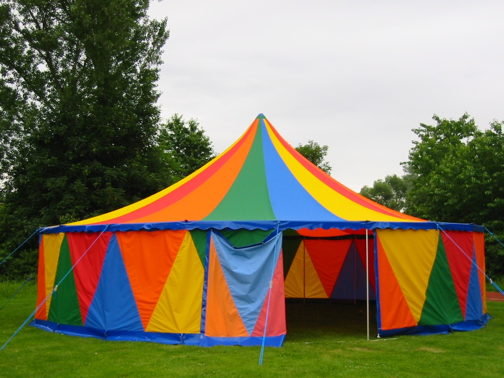

### Zirkuszelte

::: success
Hier findest du eine Übersicht (Maße inkl. Abspannungen) - unten mehr Infos

:::

| Verleih | Region | Fläche | Maße | Höhe | Kosten |  
| --- | --- | --- | --- | --- |--- |  
| Comm e.V.  | Meck-Pomm  | 180m² | 26x31m  | ~ 9m  | 500€ + 🚚  |   
| zelt-und-show.de  | Berlin  | 200m²  | 30x20m  | 8,6m  | 2850€/W  |   
| 2x Oldenburger ZZ  | Oldenburg  | 74m²  | 15m (rund)  | 4,7m  | Spende + 🚚 |   
| KJR Northeim  | Göttingen  | 74m²  | 15m (rund)  | 4,7m  | 240€/W + 🚚 |   
| KJR Enzkreis  | Stuttgart  | 72m²  | 15m (rund)  | 4,7m  | 240€/W + 🚚  |

#### große Zirkuszelte (>75m²)

::: warn
Zirkuszelte mit einer Fläche über 75m² brauchen eine Baugenehmigung durch das Amt für fliegende Bauten bzw. das zuständige Bauamt!

:::

##### [**Comm e.V.**](https://www.comm-ev.de/projekte/zirkuszelt/)

\- Transport: Erfolgt meist mit gemietetem Fahrzeug plus COMM-Anhänger  
\- Aufbau: Es gibt Menschen, die das aufbauen können - wir können versuchen zu vermitteln  
\- Kosten: 500€ pro Camp + Transport (selbstorganisiert) + 100€ Anhängermiete  
\- Kontakt: Zirkuszelt@comm-ev.de  
\- Umfang:  
\- je eine palette mit den beiden dachhälften
\- eine palette mit den seitenwänden und den planenteilen für das foyer
\- eine gitterbox mit drahtseilen, ketten, gurten etc.
\- eine palette mit schweren eisenteilen (scharnierplatten f. d. masten, - erdnagelzieher)
\- eine palette mit zubehör (elektrohammer, notausgangsbeleuchtung, arbeitsschutz)
\- eine palette mit Erdnägeln
\- das bis zu 5m lange Gestänge
=> 4 Palettenplätze (teilweise stapelbar) + 2t Anhänger mit Gestänge
=> Gewicht: ca. 3,5t, Gestänge ca. 1,3t, Erdnagelpalette ca. 700kg

##### [**Zelt-und-Show.de**](https://www.zelt-und-show.de/)

\- Transport: Miete ist inkl. Transport  
\- Aufbau: Miete ist inkl. Person, die Aufbau anleiten kann  
\- Kosten: ca 2700 - 2850€  
\- sie haben zwei 200m² zelte. 1 mit lichdurchlässiger plane, das andere mit Backstage und Vorzelt.  
\- wird in einem abschließbaren Anhänger gebracht, der könnte auf dem Camp als Lagerungsmöglichkeit genutzt werden.  
\- Kontakt: post@zelt-und-show.de

#### kleine Zirkuszelte (<75m²)

::: info
Zirkuszelte unter 75m² gibt es sehr viele überall in DE verteilt. Diese sind mehr oder weniger immer bau-gleich und können ohne Baugenehmigung aufgestellt werden.

:::

Kleine Zirkuszelte gibt es u.a bei:

**Oldenburger Zirkuszelte:**  
Privatpersonen besitzen zwei 74m² große Zirkuszelte. Der Durchmesser beträgt rund 10 Meter, der Mast ist 4,65m hoch, jedes wiegt ca. 250kg und die Transport-Maße sind ca. 2m x 1m x 0,5m. **Eines davon lagert meist in Oldenburg, das andere steht meist in Berlin. Den Transport müsst ihr selbst organisieren. Die Zelte gibts gegen Spende. Kontakt: zirkuszelte_oldenburg@riseup.net**

[**Jugendhaus Lehmbau Augsburg**](http://www.jugendhaus-lehmbau.de/verleih-vermietung/)

[KJR Miesbach ](https://www.kjr-miesbach.de/verleih/) 

[KJR Weilheim Schongau ](https://kjr-wm-sog.de/service-angebot/verleihangebot/zirkusequipment/)

[KJR Fürth ](https://www.kjr-fuerth.de/de/fuer_jugendleiterinnen_und_vereine/verleih/auswahlliste.php)

[KJR Eichstätt ](%20https://www.kjr-ei.de/index.php/materialverleih/35-zirkuszelt)

Ein 75qm Stretchtent: [KJR/SJR Augsburg ](https://www.kjr-augsburg.de/verleih/#verleihservice)

#### 